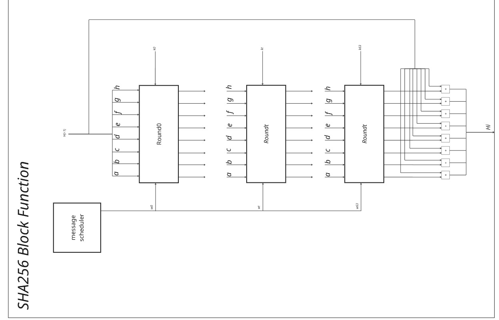
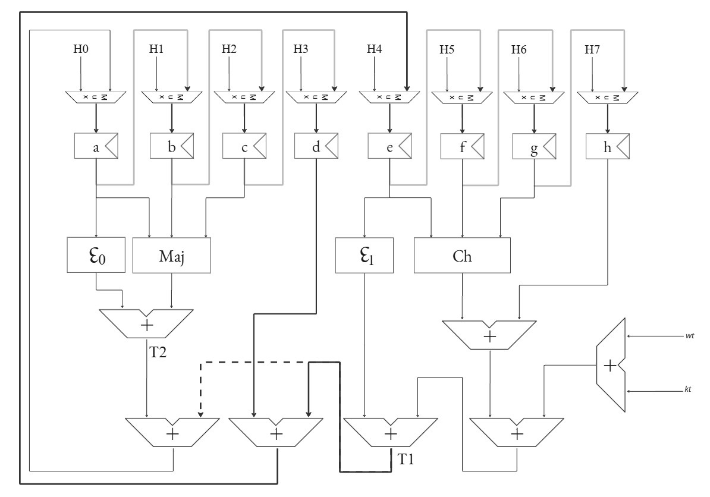
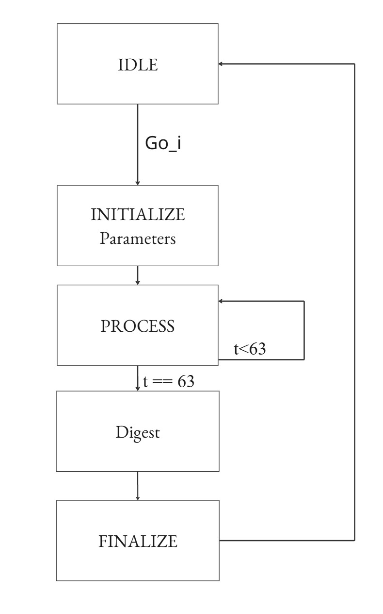

# Chaos-Image-Encryption

This project is an implemintation of a chaotic image encryption algorithm in Verilog HDL, 
refrenced from  "Chaos-Based Fast Image Encryption Scheme with
Double Zigzag Permutation and Secure SHA256
Wafaa Al-Kahla · Eyad Taqieddin ·
Ahmed S. Shatnawi" paper. 

## Status

The project in its first steps, and so far only the SHA256 hashing algorithm is attached. 
note that the implemintation for the SHA256 only hashes a single block of 512bit data currently, 
also the data must already be padded and set in memory. 

A memory IP of 256 words by 256 bits (64kb)is already set-up and initialized with some examples. 

## How it Works

The above image shows the architecture of the round function and how each block gets processed.

## How to Operate

- Clone the repository 
- Compile on quartus using Family Cyclone IV E device EP4CE11529C7
- go to Tools -> Run simulation tools -> RTL simulation (make sure ModelSim directory is specified in the EDA Tools option) 
- memory can be managed through the mem.mif file attached.  

